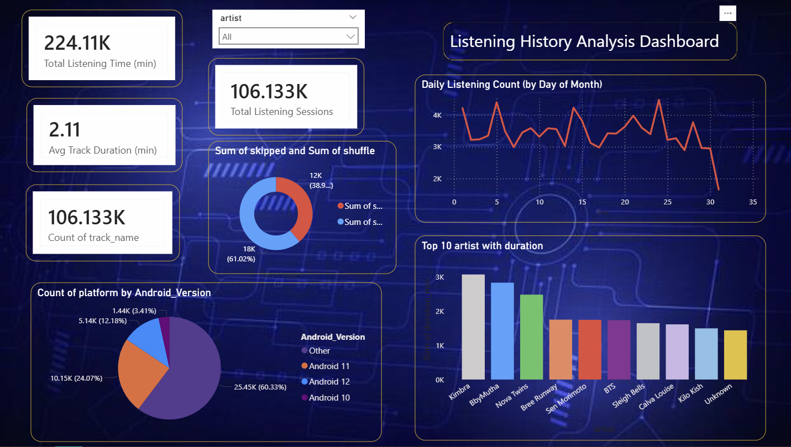

# 🎧 Listening History Analysis Dashboard

📌 Project Overview

This project focuses on analyzing music listening behavior using a Spotify-style listening history dataset. The goal is to uncover meaningful insights related to user engagement, listening trends, artist popularity, and platform usage through an interactive Power BI dashboard.

The project demonstrates end-to-end data analytics skills, including data cleaning, exploratory data analysis (EDA), and dashboard creation, making it suitable for data analyst internships.

## 🛠️ Tools & Technologies Used

Python (pandas) – Data cleaning & preprocessing

Power BI – Dashboard creation & visualization

CSV Dataset – Input data format

## 📂 Dataset Information

Source: Kaggle

Type: Music / Spotify Listening History

Size: ~100K+ records

Key Columns:

▪ id & timestamp\
▪ platform & duration_ms\
▪ track_name & artist\
▪ album & track_url\
▪ reason_start & reason_end\
▪ shuffle & skipped\
▪ source_file

## 🔄 Project Workflow

1.Data loading and inspection using pandas

2.Data cleaning (handling nulls, formatting timestamps, duration conversion)

3.Feature extraction (listening time, sessions, platform grouping)

4.Exporting cleaned data for Power BI

5.Designing an interactive Power BI dashboard

6.Extracting insights from visualizations

## 📊 Dashboard Features & Visuals

▪ KPI Cards\
▪ Total Listening Time (minutes)\
▪ Total Listening Sessions\
▪ Average Track Duration\
▪ Track Count

▪ Line Chart
▪ Daily listening count by day of month

▪ Bar Chart
▪ Top 10 artists by total listening duration

▪ Donut Chart
▪ Shuffle vs skipped listening behavior

▪ Pie Chart
▪ Platform usage by Android version

▪ Slicer
▪ Artist-wise filtering for interactive analysis

## 🔍 Key Insights

▪ Listening activity fluctuates throughout the month, with noticeable mid-month peaks  
▪ A small group of artists contributes the majority of total listening duration  
▪ Most listening sessions come from Android 11 users  
▪ Shuffle mode is used more frequently than manual track selection  

## 🎯 Project Purpose

✅ Internship-ready portfolio project

✅ Demonstrates real-world data analytics workflow

✅ Suitable for GitHub, resume, and interview discussion

#### 📸 Dashboard Preview

## ▶️ How to Run the Project

▪ Download the dataset from Kaggle  
▪ Run data cleaning and preprocessing using Python (pandas)  
▪ Export the cleaned dataset to CSV  
▪ Load the dataset into Power BI  
▪ Open the .pbix file to explore the dashboard  

## 📌 Skills Demonstrated

▪ Data cleaning & preprocessing  
▪ Exploratory data analysis (EDA)  
▪ KPI creation  
▪ Business insight generation  
▪ Interactive dashboard design  

